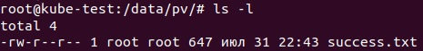
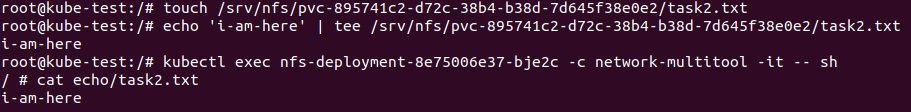

# Домашнее задание к занятию «Хранение в K8s. Часть 2» - Балдин

### Цель задания

В тестовой среде Kubernetes нужно создать PV и продемострировать запись и хранение файлов.

------

### Чеклист готовности к домашнему заданию

1. Установленное K8s-решение (например, MicroK8S).
2. Установленный локальный kubectl.
3. Редактор YAML-файлов с подключенным GitHub-репозиторием.

------

### Дополнительные материалы для выполнения задания

1. [Инструкция по установке NFS в MicroK8S](https://microk8s.io/docs/nfs). 
2. [Описание Persistent Volumes](https://kubernetes.io/docs/concepts/storage/persistent-volumes/). 
3. [Описание динамического провижининга](https://kubernetes.io/docs/concepts/storage/dynamic-provisioning/). 
4. [Описание Multitool](https://github.com/wbitt/Network-MultiTool).

------

### Задание 1

**Что нужно сделать**

Создать Deployment приложения, использующего локальный PV, созданный вручную.

1. Создать Deployment приложения, состоящего из контейнеров busybox и multitool.

<details>
<summary>Манифест Deployment</summary>

```yaml
apiVersion: apps/v1
kind: Deployment
metadata:
  name: task1-deployment
  labels:
    app: echo
spec:
  replicas: 1
  selector:
    matchLabels:
      app: echo
  template:
    metadata:
      labels:
        app: echo
    spec:
      containers:
      - name: busybox
        image: busybox
        command: ['sh', '-c', 'mkdir -p /out/logs && while true; do echo "$(date) - Success" >> /out/logs/success.txt; sleep 5; done']
        volumeMounts:
        - name: test-vol-pvc
          mountPath: /tmp/cache

      - name: network-multitool
        image: wbitt/network-multitool
        volumeMounts:
        - name: test-vol-pvc
          mountPath: /echo
        env:
        - name: HTTP_PORT
          value: "80"
        - name: HTTPS_PORT
          value: "443"
        ports:
        - containerPort: 80
          name: port-http
        - containerPort: 443
          name: port-https
        resources:
          requests:
            cpu: "1m"
            memory: "20Mi"
          limits:
            cpu: "10m"
            memory: "20Mi"
      volumes:
      - name: test-vol-pvc
        persistentVolumeClaim:
          claimName: pvc-vol
```

</details>

2. Создать PV и PVC для подключения папки на локальной ноде, которая будет использована в поде.

<details>
<summary>PV</summary>
  
```yaml
apiVersion: v1
kind: PersistentVolume
metadata:
  name: pv-test
spec:  
  capacity:
    storage: 1Gi
  accessModes:
    - ReadWriteOnce
  hostPath:
    path: /data/pv
  persistentVolumeReclaimPolicy: Retain
  storageClassName: local-storage
```

</details>

<details>
<summary>PVC</summary>

```yaml
apiVersion: v1
kind: PersistentVolumeClaim
metadata:
  name: pvc-vol
spec:
  storageClassName: local-storage
  accessModes:
    - ReadWriteOnce
  resources:
    requests:
      storage: 1Gi
```

</details>

```bash
$ kubectl get pv
NAME        CAPACITY   ACCESS MODES   RECLAIM POLICY   STATUS   CLAIM             STORAGECLASS    REASON   AGE
pv-test     1Gi        RWO            Retain           Bound    default/pvc-vol   local-storage            10m
```

```bash
$ kubectl get pvc
NAME      STATUS   VOLUME   CAPACITY   ACCESS MODES   STORAGECLASS    AGE
pvc-vol   Bound    pv       1Gi        RWO            local-storage   10m
```

3. Продемонстрировать, что multitool может читать файл, в который busybox пишет каждые пять секунд в общей директории. 

```bash
$ kubectl exec task1-deployment-796c67fc6d-dq7de -c network-multitool -it -- sh
/ # cat /out/logs/success.txt
Чт 31 июл 2024 22:43:11 +03 - Success
Чт 31 июл 2024 22:43:16 +03 - Success
Чт 31 июл 2024 22:43:21 +03 - Success
Чт 31 июл 2024 22:43:16 +03 - Success
```

4. Удалить Deployment и PVC. Продемонстрировать, что после этого произошло с PV. Пояснить, почему.

```bash
$ kubectl get pv
NAME       CAPACITY   ACCESS MODES   RECLAIM POLICY   STATUS   CLAIM             STORAGECLASS   REASON   AGE
pv-test    1Gi        RWO            Retain           Bound    default/pvc-vol   local-storage           27m
```

PV не удалился. Ну на то он и persistent, выступает как самостоятельная сущность в кластере. 

5. Продемонстрировать, что файл сохранился на локальном диске ноды. Удалить PV. Продемонстрировать что произошло с файлом после удаления PV. Пояснить, почему.



Файл сохранился, так как **persistentVolumeReclaimPolicy** в статусе **Retain**, что не позволяет автоматически удаить ресурсы после удаления PV.

6. Предоставить манифесты, а также скриншоты или вывод необходимых команд.

------

### Задание 2

**Что нужно сделать**

Создать Deployment приложения, которое может хранить файлы на NFS с динамическим созданием PV.

1. Включить и настроить NFS-сервер на MicroK8S.
2. Создать Deployment приложения состоящего из multitool, и подключить к нему PV, созданный автоматически на сервере NFS.

<details>
<summary>Манифест Deployment</summary>

```yaml
apiVersion: apps/v1
kind: Deployment
metadata:
  name: nfs-deployment
  labels:
    app: multitool
spec:
  replicas: 1
  selector:
    matchLabels:
      app: multitool
  template:
    metadata:
      labels:
        app: multitool
    spec:
      containers:
        - image: wbitt/network-multitool
          volumeMounts:
          - name: test-vol-pvc
            mountPath: /echo
          name: network-multitool
      volumes:
      - name: test-vol-pvc
        persistentVolumeClaim:
          claimName: my-pvc-nfs
```

</details>

<details>
<summary>PVС2</summary>
  
```yaml
apiVersion: v1
kind: PersistentVolumeClaim
metadata:
  name: my-pvc-nfs
spec:
  storageClassName: nfs-stor
  accessModes: [ReadWriteOnce]
  resources:
    requests:
      storage: 1Gi
```

</details>

<details>
<summary>SCl</summary>

```yaml
apiVersion: storage.k8s.io/v1
kind: StorageClass
metadata:
  name: nfs-stor
provisioner: nfs.csi.k8s.io
reclaimPolicy: Delete
parameters:
  server: 192.168.31.77
  share: /srv/nfs
reclaimPolicy: Delete
volumeBindingMode: Immediate
mountOptions:
  - hard
  - nfsvers=4.1
```

</details>

3. Продемонстрировать возможность чтения и записи файла изнутри пода. 

Чтобы проверить, нужно создать файл на ноде в папке, где автоматом создался pv. После чего проверить доступность файла внутри пода.



4. Предоставить манифесты, а также скриншоты или вывод необходимых команд.

------

### Правила приёма работы

1. Домашняя работа оформляется в своём Git-репозитории в файле README.md. Выполненное задание пришлите ссылкой на .md-файл в вашем репозитории.
2. Файл README.md должен содержать скриншоты вывода необходимых команд `kubectl`, а также скриншоты результатов.
3. Репозиторий должен содержать тексты манифестов или ссылки на них в файле README.md.
